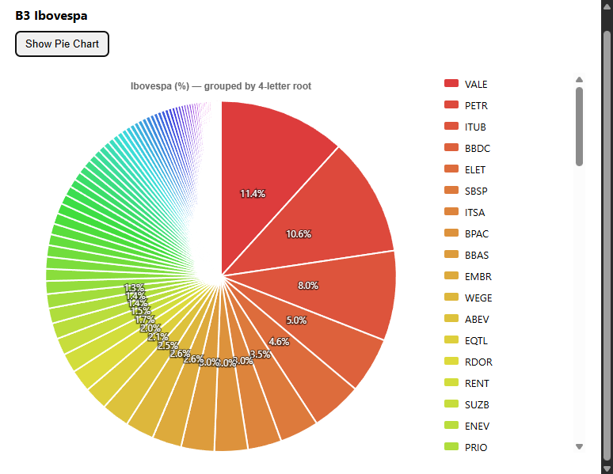

# 📊 IbovChart Extension

Extensão para Google Chrome (Manifest V3) que acessa a página da **B3** e extrai a composição do índice **Ibovespa**, exibindo os dados em um **gráfico de pizza interativo** (Chart.js).

> ⚠️ **Importante:**  
> Esta extensão funciona especificamente na página oficial da B3 com a composição do Ibovespa:  
> [https://www.b3.com.br/pt_br/market-data-e-indices/indices/indices-amplos/indice-ibovespa-ibovespa-composicao-da-carteira.htm](https://www.b3.com.br/pt_br/market-data-e-indices/indices/indices-amplos/indice-ibovespa-ibovespa-composicao-da-carteira.htm)

---

## 🚀 Funcionalidades
- Captura automaticamente a tabela da B3 (composição do Ibovespa).
- Consolida ações com o mesmo código base (ex.: PETR3 + PETR4).
- Exibe **gráfico de pizza interativo** com as proporções.
- Opção de visualizar **todas as ações** ou apenas o **Top 10**.
- Ícones customizados inspirados em gráficos/bolsa de valores.

---

## 📦 Estrutura do Projeto
```text
bootcamp2-entrega-inicial-danieloda/
├─ docs/                 # GitHub Pages demo
│  └─ index.html
├─ icons/                # Ícones da extensão
│  ├─ icon16.png
│  ├─ icon32.png
│  ├─ icon48.png
│  └─ icon128.png
├─ src/
│  ├─ assets/            # Bibliotecas (Chart.js)
│  │  └─ chart.umd.min.js
│  ├─ background/        # Service Worker
│  │  └─ service-worker.js
│  ├─ content/           # Content script (captura B3)
│  │  └─ content.js
│  ├─ popup/             # UI do popup
│  │  ├─ popup.html
│  │  ├─ popup.css
│  │  └─ popup.js
│  └─ styles/            # CSS global
│     └─ global.css
├─ manifest.json         # Manifest V3 da extensão
├─ README.md             # Documentação do projeto
└─ LICENSE               # Licença MIT
```

---

## 🔗 Links

- **Repositório GitHub:** [danieloda/bootcamp2-entrega-inicial-danieloda](https://github.com/danieloda/bootcamp2-entrega-inicial-danieloda)  
- **GitHub Pages (demo):** [Site do projeto](https://danieloda.github.io/bootcamp2-entrega-inicial-danieloda/)  
- **Download Release (.zip):** [Última versão](https://github.com/danieloda/bootcamp2-entrega-inicial-danieloda/releases)  

---

## 🛠️ Tecnologias
- [Manifest V3](https://developer.chrome.com/docs/extensions/mv3/)  
- HTML, CSS, JavaScript  
- [Chart.js](https://www.chartjs.org/)  

---

## 🧩 Instalação Manual
1. Baixe o repositório ou release `.zip`.  
2. Acesse `chrome://extensions` no navegador.  
3. Ative **Developer Mode** (Modo Desenvolvedor).  
4. Clique em **Load unpacked** e selecione a pasta do projeto.  
5. O ícone da extensão aparecerá ao lado da barra de endereço.  

---

## 📸 Screenshots
  
  
    

---

## 📜 Licença
Este projeto está sob a licença **MIT**.  
Veja o arquivo [LICENSE](LICENSE) para mais detalhes.